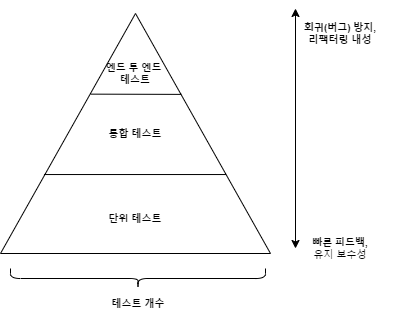

# 단위 테스트 - 블라디미르 코리코프

### 1장: 단위 테스트의 목표

- 무엇이 성공적인 테스트 스위트를 만드는가
    - 개발 주기에 통합된 TS
    - 코드 베이스에서 가장 중요한 부분만을 대상으로 하는 TS
    - 최소한의 유지비로 최대의 가치를 끌어내는 TS

---

### 2장: 단위 테스트란 무엇인가

- **단위 테스트의 정의**
    1. 작은 코드 조각(단위)을 검증하고,
    2. 빠르게 수행하며
    3. **격리된 방식으로 처리**하는 자동화된 테스트다.
    
     3번은 단위 테스트를 접근하는 관점을 구분하는 중요한 요소다. 여기서 언급하는 격리라는 요소가 무엇인지에 따라 ‘고전파', ‘런던파'로 나눠진다. 
    
- **격리 문제에 대한 런던파, 고전파의 접근**
    
    둘은 격리 대상을 어디까지 두는가에 따라 구분된다. 런던파는 클래스와 연관된 모든 협력자(외부 의존성, 애플리케이션 내부 클래스들까지)를 테스트 대역으로 대체한다. 
    
    반면 고전파는 단위 테스트간 공유 상태를 일으키는 의존성에 대해서만 협력자를 테스트 대역으로 대체한다. 정적 가변 필드, 파일 시스템, 데이터베이스 등과 같은 프로세스 외부 의존성이 대표적인 예시다.
    
    정리하자면 **“격리”**라는 단어는 런던파에게는 SUT에서 모든 *협력자를 격리*하는 것이지만, 고전파는 *단위 테스트(A↔B)끼리 격리*하는 것을 의미한다. 
    
    따라서 고전파의 관점에서 단위 테스트의 정의를 재정의해보면 아래와 같다.
    
    1. **단일 동작 단위를 검증하고**
    2. **빠르게 수행하며**
    3. **다른 테스트와 별도로 처리한다.** 
- **버그 위치 정확히 찾아내기**
    
    런던파는 모든 협력자를 격리하기 때문에 보통 SUT에 버그가 포함된 테스트만 실패한다. 하지만 고전파는 오작동한 클래스를 참조하는 클라이언트가 대상이 되는 테스트도 실패할 수 있다. 
    
    예를 들어 *더하기* 기능을 제공하는 클래스를 *상점* 클라이언트가 참조하고 있다면, *상점* 클래스에서 *더하기* 기능을 사용하는 동작의 단위 테스트가 실패할 가능성이 높다.
    
    언뜻 보기에는 하나의 버그가 전체 시스템에 걸쳐 테스트 실패를 야기하는 파급 효과를 초래하고, 문제의 원인을 파악하는데에 어려움을 주는 것처럼 보인다. 
    
    하지만 이는 버그가 테스트 하나 뿐만 아니라, 많은 테스트에서 결함을 야기한다는 것을 의미한다. 즉, 방금 고장낸 코드가 얼마나 많은 영향력을 행사하고 있는지를 파악할 수 있다. 
    

---

### 3장: 단위 테스트 구조

- **단위 테스트의 구성**
    - AAA 패턴
        - 준비, 실행, 검증의 순서로 테스트를 나누는 것이다. 이는 테스트 스위트 내의 모든 테스트가 단순하고 균일한 구조를 가지도록 만든다.
        - 프로그래머가 아닌 사람들이 이해하기 쉽도록 *Given-When-Then* 구조를 사용하자.
    - 테스트 내의 if문은 안티 패턴이다. 테스트가 너무 많은 것을 검증한다는 증거다.
    - 보통은 준비 구절이 가장 크다. 하지만 만약에 너무 과도하게 크다면 테스트 클래스 내에서 별도의 비공개 메서드 혹은 팩토리 클래스로 도출하는 것이 좋다.
        - 오브젝트 마더 패턴
        - 테스트 데이터 빌더 패턴
    - 실행 구절이 메서드 하나 이상을 호출하는 경우, 대부분은 SUT 내부의 API 설계 문제다.
- 테스트 픽스처란
    - 테스트 픽스처는 준비 구절에서 테스트 실행 대상 객체다.
        - ‘픽스처'는 각 테스트들이 실행되기 전 고정 상태로 유지하는 것에서 비롯됐다.
    - 테스트 픽스처는 제대로 사용하면 중복되는 코드들을 제거할 수 있지만, 잘못 사용될 경우 테스트 간 결합도를 향상시키며 가독성을 저하시킨다.
        - 테스트 생성자에서 픽스처(테스트 대상 객체) 초기화하는 것은 위의 문제를 야기하는 안티 패턴이다.
        - 예제 코드
            
            ```java
            public class CustomerTests {
            	
            	private Store store;
            	private Customer sut;
            	
            	public CustomerTest() {
            		this.store = new Store();
            		store.addInventory(Product.SHAMPOO, 10);
            		this.sut = new Customer();
            	}	
            
            	@Test
            	public void purchase_succeeds_when_enough_inventory(){
            		// given
            		// On Test Fixture!!
            
            		// when
            		boolean success = sut.purchase(store, Product.SHAMPOO, 5);
            		
            		// then
            		assertThat(success).isTrue();
            		assertThat(store.getInventory(Product.SHAMPOO)).isEqualTo(5);
            	}
            
            	@Test
            	public void purchase_fails_when_not_enough_inventory(){
            		// given
            		// On Test Fixture!!
            
            		// when
            		boolean success = sut.purchase(store, Product.SHAMPOO, 15);
            		
            		// then
            		assertThat(success).isFalse();
            		assertThat(store.getInventory(Product.SHAMPOO)).isEqualTo(10);
            	}
            }
            ```
            
            위처럼 생성자에서 픽스처를 초기화하게 되면 해당 클래스 내부의 모든 테스트가 생성자에 결합된다. 만약 여기서 생성자에서 추가해주는 샴푸의 개수가 15개로 바뀌면 모든 테스트가 실패한다. 즉 테스트들이 서로 격리된 환경을 유지하지 못한다는 것을 의미한다. 
            
        - 이는 테스트 클래스의 비공개 팩토리 메서드를 통해 해결할 수 있다.
            
            ```java
            public class CustomerTests {
            
            	@Test
            	public void purchase_succeeds_when_enough_inventory(){
            		// given
            		Store store = CreateStoreWithInventory(Product.SHAMPOO, 10);
            		Customer sut = CreateCustomer();
            
            		// when
            		boolean success = sut.purchase(store, Product.SHAMPOO, 5);
            		
            		// then
            		assertThat(success).isTrue();
            		assertThat(store.getInventory(Product.SHAMPOO)).isEqualTo(5);
            	}
            
            	@Test
            	public void purchase_fails_when_not_enough_inventory(){
            		// given
            		Store store = CreateStoreWithInventory(Product.SHAMPOO, 10);
            		Customer sut = CreateCustomer();
            
            		// when
            		boolean success = sut.purchase(store, Product.SHAMPOO, 15);
            		
            		// then
            		assertThat(success).isFalse();
            		assertThat(store.getInventory(Product.SHAMPOO)).isEqualTo(10);
            	}
            
            	private Store CreateStoreWithInventory(Product product, int quantity){
            		Store store = new Store();
            		store.addInventory(Product.SHAMPOO, quantity);
            		return store;
            	}
            
            	private Customer CreateCustomer(){
            		return new Customer();
            	}
            }
            ```
            

- **단위 테스트 명명법**
    - 표현력 있는 단위 테스트명은 테스트가 검증하는 내용과 기본 시스템의 동작을 이해하는데에 많은 도움을 준다.
    - 아래는 표현력 있고 읽기 쉬운 테스트 이름을 위한 지침이다.
        1. 엄격한 명명 정책을 따르지 말자. 복잡한 동작에 대한 높은 수준의 설명을 하기 위해서 표현의 자유를 허용하자.
        2. 문제 도메인에 익숙하지 않은 비개발자들에게 시나리오를 설명하는 것처럼 짓자.
        3. ‘_’를 활용해 단어를 구분해라. 가독성이 나아진다.
        4. 테스트 이름에 SUT의 메서드 이름을 포함하지 마라. 단위 테스트는 코드가 아닌 애플리케이션의 동작을 테스트하는 것이다. 메서드 이름을 명시하는 순간 또다른 결합도의 시작이다.
- **매개변수화된 테스트 리팩터링하기**
    - 테스트 하나로 동작 단위를 완전하게 설명하기는 쉽지 않다. 프레임워크에서 제공하는 기능을 사용해 유사 테스트를 묶자. (ex. JUnit → `@ParameterizedTest`)
- **검증문 라이브러리를 사용한 테스트 가독성 향상**
    - 목적은 검증문을 재구성해 가독성을 높이는 것이다. Java 진영에는 AssertJ 라이브러리가 존재한다.
    - 인간은 이야기 형태로 정보를 흡수하는 것을 선호한다.
        - [주어] [행동] [목적어]
            
            ```java
            // [주어] store, [행동] getInventory, [목적어] 5                    
            assertThat(store.getInventory()).isEqualTo(5)
            ```
            
        

---

### 4장: 좋은 단위 테스트의 4대 요소

- **좋은 단위 테스트의 4가지 특성**
    - 회귀(버그) 방지
    - 리팩터링 내성
    - 빠른 피드백
    - 유지 보수성
- **첫 번째, 회귀 방지**
    - 코드는 자산이 아니라 책임이다.
    - 복잡한 비즈니스 로직을 나타내는 코드가 중요하다.
    - 단순한 코드를 테스트하는 것은 의미가 없다.
- **두 번째, 리팩터링 내성**
    - 테스트를 실패하지 않고, 기본 애플리케이션 코드를 리팩터링할 수 있는지에 대한 척도를 의미한다.
        - 리팩터링은 식별할 수 있는 동작을 수정하지 않고 기존 코드를 변경하는 것을 의미한다.
        - 의도는 비기능적 특징을 개선하고 가독성을 높이며, 복잡도를 낮추는 것이다.
    - 기능은 예전처럼 완벽하게 동작하지만 테스트가 실패한다. 이는 테스트가 거짓말을 하고 있다는 것을 의미한다. 이런 상황을 **거짓 양성**이라고 한다.
    - 거짓 양성은 허위 경보다. 적을 수록 좋다. 중요한 이유는 단위 테스트의 목적인 소프트웨어의 지속적인 성장과 연관돼있다.
        - 지속적인 성장은 버그없이 주기적으로 리팩터링하고 새로운 기능을 추가할 수 있는 것이다.
        - 하지만 만약 테스트가 이유없이 실패하면 타당한 실패를 무시하는 결과로 이어진다.
        - 따라서 테스트 스위트에 대한 신뢰가 떨어지고, 이를 안전망으로 인식하지 않는다. 따라서 신뢰의 부족에 따른 리팩터링의 감소가 유발되며 결국 사람들은 테스트 스위트를 양치기 소년으로 인식한다.
    - 거짓 양성의 원인은 테스트 구성 방식과 연결된다. 테스트와 SUT의 구현 세부사항이 많이 결합할수록 허위 경보가 많이 생긴다.
        - 이를 줄이기 위해선 테스트가 구현 세부 사항 대신 최종 결과를 목표로 해야 한다.
- **세 번째, 네 번째, 빠른 피드백과 유지 보수성**
    - 오래 걸리는 테스트를 자주 실행하지 못하게 만든다.
    - 유지 보수성이란 것은 ‘테스트가 얼마나 이해하기 쉬운가’와 ‘테스트가 얼마나 실행하기 어려운가’를 의미한다.
- **이상적인 테스트를 찾아서의 결론**
    - 4가지 요소를 서로 양보해 최선을 찾아야 한다.
    - 라고 말했지만, 실제로는 **무조건 리팩터링 내성을 최대화**시켜야 한다. 그리고 나서 회귀 방지와 빠른 피드백 사이에서 트레이드 오프를 결정해라.
        - 회귀 방지는 엔드 투 엔드 테스트(사용자 동작을 최대한 가깝게 흉내)와 가깝고, 빠른 피드백은 단위 테스트와 가깝다. 그 사이는 통합 테스트다.
        - 세 가지 테스트의 비율은 엔드 투 엔드 → 단위 테스트 순으로 피라미드 형태를 갖춰야 한다. 물론 예외는 있다.
    - 테스트 자동화 개념에는 시스템의 내부 구조를 몰라도 시스템의 기능을 검사하는 블랙박스 테스트와 애플리케이션의 내부 작업을 검증하는 화이트박스 테스트 방식이 있다.
        - 리팩터링 내성은 타협할 수 없다. 무조건 블랙박스 테스트를 디폴트로 가져가라.

---

### 5장: 목과 테스트 취약성

- **테스트 대역의 유형**
    - 테스트 대역은 그게 목(Mock)과 스텁(Stub)으로 나눠진다.
    - Mock: 외부로 나가는 상호 작용을 모방하고 검사하고자 할 때 필요하다. 이 때의 상호작용은 SUT가 상태를 변경하기 위한 의존성을 호출하는 것을 의미한다.
    - Stub: 내부로 들어오는 상호 작용을 모방하는 데 도움이 된다. 이 때의 상호작용은 SUT가 입력 데이터를 얻기 위한 의존성을 호출하는 것을 의미한다.
        - 스텁으로 상호 작용을 검증하는 것은 내부 구현이 테스트와 결합되는 취약점을 야기하는 안티 패턴이다.
- **목, 스텁과 CQS(Command Query Separation, 명령 조회 분리)**
    - 명령을 대체하는 테스트 대역은 목이다. 명령은 상태를 변경해 부작용(객체 상태 변경, 파일 시스템 내의 파일 변경)의 가능성이 존재하지만 아무것도 반환하지 않는다.
    - 조회를 대체하는 테스트 대역은 스텁이다. 조회는 상태를 변경하지 않기 때문에 부작용이 없고 조회 결과를 반환한다.
- **육각형 아키텍쳐**
    - 대부분의 애플리케이션은 도메인과 애플리케이션 서비스 계층을 가지고 있다. 이 때 애플리케이션 서비스 계층은 도메인 계층 위에서 외부 환경과의 통신을 조정한다.
        - 데이터베이스를 조회하고, 해당 데이터로 도메인 클래스 인스턴스 구체화
        - 해당 인스턴스에 연산 호출
        - 결과를 데이터베이스에 다시 저장
    - 육각형 아케틱쳐의 목적은 아래와 같다.
        - 도메인 계층과 애플리케이션 서비스 계층 간의 서비스 관심사 분리
            - 도메인 계층은 비즈니스 로직 외에는 어떤 책임을 가져서도 안된다.
        - 애플리케이션 내부 통신
            - 육각형 아키텍쳐는 의존성이 애플리케이션 서비스 계층 → 도메인 계층으로 흐르도록 단방향 의존성 흐름을 규정한다.
            - 즉, 도메인 계층은 애플리케이션 서비스 계층에 대한 의존성이 있어선 안된다.
    - 잘 설계된 시스템이 식별할 수 있는 동작은 바깥 계층에서 안으로 흐른다. 이렇지 않다면 세부 구현이 결합되어 있다는 것을 의미한다.
- **시스템 내부 통신과 시스템 간 통신**
    - 서드 파티 시스템과 SMTP 서비스와 애플리케이션이 통신하는 것을 시스템 간 통신, 애플리케이션 내에서 도메인 클래스들이 협력하기 위한 통신은 시스템 내부 통신이다.
    - 목은 시스템 간 통신을 확인할 때 좋다. 만약 시스템 내부 통신에 사용하게 되면 테스트가 구현 세부 사항과 결합되며, 결국 리팩터링 내성 지표를 하락시킨다.
- **모든 프로세스 외부 의존성을 목으로 대체할 필요는 없다**
    - 아래는 의존성의 유형이다.
        - 공유 의존성: 테스트 간 공유하는 의존성(프로덕션 코드 X)
        - 프로세스 외부 의존성: 데이터베이스, 메시지 버스, SMTP 서비스
        - 비공개 의존성: 공유하지 않는 모든 의존성
    - 공유 의존성이 프로세스 외부에 있다면 테스트에 존재하는 의존성을 격리하기 어려워진다. 따라서 이 때 의존성을 목, 스텁으로 대체하면 된다.
    - 하지만 의존성이 애플리케이션을 통해서만 접근할 수 있다면, 애플리케이션의 일부와 같다. 그 예시로 애플리케이션 데이터베이스가 있다. 만약 어떤 외부 시스템도 이 데이터베이스에 접근할 수 없다면, 우리가 완벽한 통제권을 갖는다면 이는 애플리케이션의 구현 세부 사항이다. 하지만 이는 빠른 속도를 가질 수 없다는 치명적인 단점이 있다.

---

### 6장: 단위 테스트 스타일

- **단위 테스트의 세 가지 스타일**
    - 출력 기반 테스트: SUT에 입력을 넣고 생성되는 출력을 점검하는 방식
    - 상태 기반 테스트: 작업이 완료된 후 시스템 최종 상태를 확인하는 것
        - 여기서 ‘상태'는 SUT, 협력자 중 하나, 데이터베이스 혹은 파일 시스템과 같은 프로세스 외부 의존성의 상태를 의미할 수도 있다.
    - 통신 기반 테스트: 목을 사용해 테스트 대상 시스템과 협력자 간의 통신을 검증
        - SUT의 협력자를 목으로 대체해, SUT가 협력자를 올바르게 호출하는지 검증한다.
- **회귀 방지와 속도 지표로 비교**
    - 회귀 방지 지표는 테스트 중 실행되는 코드의 양, 코드 복잡도, 도메인 유의성을 통해 결정된다. 이 때 통신 기방 스타일을 제외하고는 상관관계가 거의 없다.
    - 피드백 속도 역시 스타일과 상관관계가 거의 없다.
    - 두 조건 모두 목을 사용하는 통신 기반 테스트와 관련되어 있지만, 큰 차이는 없다.
- **리팩터링 내성 지표, 유지비로 스타일 비교하기**
    
    
    |  | 출력 기반 | 상태 기반 | 통신 기반 |
    | --- | --- | --- | --- |
    | 리팩터링 내성을 지키기 위해 필요한 노력 | 낮음 | 중간 | 중간 |
    | 유지비 | 낮음 | 중간 | 높음 |
    - 상태 기반 테스트에서 검증부가 비대해지는 부작용은 헬퍼 메서드로 대체할 수 있다.
    - 하지만 이는 클래스가 값 객체로 변환할 수 있을 경우만 효과적이다.
- **함수형 아키텍쳐를 통해 상태, 통신 기반 테스트를 출력 기반으로 변경하기**
    - 사실 어떤 부작용도 일으키지 않는 애플리케이션을 만들수는 없다. 따라서 함수형 프로그래밍을 통해 부 작용을 완전히 제거하는 것이 아닌, 비즈니스 로직 처리 코드와 부작용을 일으키는 코드를 분리하는 것이다.
        - 결정을 내리는 코드(함수형 코어): 이 코드는 부작용이 필요없다. 따라서 수학적 함수를 사용할 수 있다.
        - 해당 결정에 따라 작용하는 코드(가변 셸): 내려진 결정을 데이터베이스의 변경이나 메시지 버스로 전송된 메시지와 같이 가시적인 부분으로 변환한다.
    - 가변 셸은 입력 생성과 코어에서 나온 결정을 부작용으로 변환하는 역할을, 코어는 결정을 내리는 역할만 하도록 분리한다.
        - 이를 통해 코어를 출력 기반 테스트로 핸들링하고, 부작용은 통합 테스트로 처리하도록 만들 수 있다.
- **함수형 아키텍쳐와 육각형 아키텍쳐 비교**
    - 둘은 관심사 분리라는 아이디어를 기반으로 한다.
        - 육각형 아키텍쳐는 도메인 계층(비즈니스 로직에 대한 책임)과 애플리케이션 서비스 계층(외부 애플리케이션과의 통신에 대한 책임)을 분리한다.
        - 함수형 아키텍쳐 역시 결정과 분리를 분리한다.
        - 의존성이 서로나 하위 계층에게만 흐르고, 상위 계층으로 거슬러 올라가지 않는다.
        - 둘의 차이는 부작용을 처리하는 부분이다. 함수형 아키텍처는 항상 가변 셸이 처리하지만, 육각형 아키텍쳐는 모든 부작용(수정 사항)이 도메인 계층 내에 있어야 한다. 즉 부작용이 계층의 경계를 넘어서는지가 차이점이다.
- **함수형 아키텍쳐와 출력 기반 테스트로의 전환** *[Link](https://github.com/AcornPublishing/unit-testing/tree/main/Book/Chapter6/Listing7_)*
    - 예제는 파일 시스템을 사용하는 감사 시스템이다.
        - 요구사항
            1. 방문자를 추적하는 시스템으로 텍스트 파일에 방문자, 방문시각을 기록한다.
            2. 파일은 저장할 수 있는 최대 항목수가 존재한다.
            3. 만약 최대 항목수에 도달하면 새로운 파일을 작성한다.
    1. **초기 도메인 클래스는 프로세스 외부 의존성과 직접 협력** [Link](https://github.com/AcornPublishing/unit-testing/blob/main/Book/Chapter6/Listing7_/Before/ArchitectureBefore.cs)
        
        `AuditManager` ↔ `Directory.GetFiles()`, `File.WriteAllText()`, `File.ReadAllLines()`
        
    2. **인터페이스(**`IFileSystem`**)을 새롭게 생성하고, 인자로 이를 주입받아 부작용에 대한 책임을 위임** [Link](https://github.com/AcornPublishing/unit-testing/blob/main/Book/Chapter6/Listing7_/Mocks/ArchitectureMocks.cs)
        
        `AuditManager` ↔ `IFileSystem.getFiles()`, `IFileSystem.writeAllText()`, `IFileSystem.ReadAllLines()` 
        
        이 단계부터 목을 통한 출력 기반 테스트가 가능
        
    3. **부작용을 인터페이스 뒤로 숨기고 인터페이스를** `AuditManager`**에 주입하는 대신, 부작용 자체를 클래스 외부로 이동시켜버린다.**
        
        이를 통해 `AuditManager`는 파일에 수행할 작업에 관한 결정만 책임지도록 변경된다. 그리고 이에 대한 결정(부작용)을 파일 시스템에 업데이트할 `Persist`를 생성한다.
        
        `AuditManger`는 이젠 `IFileSystem.getFiles()`를 통해 가져왔던 파일 목록을 인자(`FileContent` 클래스의 인스턴스 배열)로 받는다.
        
        `AuditManager`는 파일을 작성하거나 수정하는 결정을 내리기 위해 필요한 정보를 인자와 내부 필드를 통해 모두 이미 알고 있다.
        
        이제 작업 디렉터리의 파일을 AuditManager가 직접 변경했던 1번과 달리, 수행하려는 부작용(업데이트 명령,`FileUpdate` 인스턴스 생성)을 반환한다.
        
    4. `Persist` 클래스 생성
        
        1번에서 AuditManager가 직접 `File`, `Directory`와 협력했던 것을 대신하는 클래스다. 함수형 코어는 `AuditManager`가 수행하고 가변 셸은 `Persist`가 수행한다.
        
    5. 둘을 이어주는 애플리케이션 서비스 계층 `ApplicationService` 계층 생성 [Link](https://github.com/AcornPublishing/unit-testing/blob/main/Book/Chapter6/Listing7_/Functional/ArchitectureFunctional.cs)
        
        ```java
        public ApplicationService {
        	private String directoryName;
        	private String AuditManager auditManager;
        	private Persister persister;
        
        	public ApplicationService(String directoryName, int maxEntriesPerFile){
        		this.directoryName = directoryName;
        		this.auditManager = new AuditManager(maxEntriesPerFile);
        		this.persister = new Persister();
        	}
        
        	public void addRecord(String visitorName, DateTime timeOfVisit){
        		FileContent[] files = persister.readDirectory(directoryName);
        		FileUpdate update = auditManager.addRecord(
        				files, visitorName, timeOfVisit);
        		persister.applyUpdate(directoryName, update);
        	}
        }
        ```
        
    - 위 과정을 살펴보면 결국 애플리케이션 서비스와 도메인 모델 계층의 도메인 주도 개발 패턴으로 최종 결과가 완성된다.
    - 프로세스 외부 의존성과 직접 통신하지 않고, 인다이렉션을 생성하는 것이 출력 기반 테스트로 변환하는 것의 핵심이다.
    - 예를 들자면 OrderService.save()와 같은 애플리케이션 서비스 계층은 결국 검증할 필요가 없음. 도메인 클래스가 **Order가 도메인 클래스들 간 이루어진 비즈니스 로직에 의해 정상적으로 생성되었는지**만 판단하기만 하면 된다.

---

### 7장: 가치 있는 단위 테스트를 위한 리팩터링

- **코드의 네 가지 유형**
    - 프로덕션 코드는 복잡도 및 도메인 유의성의 정도와 협력자 수의 조합으로 총 4가지 유형이 존재한다.
        
        
        | 복잡도 및 도메인 유의성 \ 협력자의 수 | 적다 | 많다 |
        | --- | --- | --- |
        | 작다 | 간단한 코드
        ex. 변수가 없는 생성자, 한 줄 속성 | 컨트롤러 
        ex. 도메인 클래스와 외부 애플리케이션 같은 다른 구성 요소의 작업을 조정 |
        | 크다 | 도메인 모델 및 알고리즘
        ex. 100% 도메인 모델은 아니다, 도메인과 관련이 없는 복잡한 알고리즘일 수도 있음 | 지나치게 복잡한 코드
        ex. 협력자가 많으며 복잡하거나 중요한 것, 모든 것을 해결하는 덩치 큰 컨트롤러 |
        - 단위 테스트가 가장 가치있는 것은 도메인 모델 및 알고리즘이다. 간단한 코드는 테스트할 필요가 없고, 컨트롤러는 통합 테스트로 간단히 테스트하면 된다.
        - 반면 지나치게 복잡한 코드는 단위 테스트를 작성하기 쉽지 않지만, 그렇다고 내버려둘 수도 없다. 따라서 이 때는 컨트롤러와 알고리즘으로 나눠 작성해야 한다.
- **험블 객체 패턴을 사용해 지나치게 복잡한 코드 분할하기**
    - 지나치게 복잡한 코드는 험블 객체 패턴이 필요하다. 테스트하기 위해선 테스트가 가능한 부분을 추출해야 한다. 이 때 코드를 테스트하기 어려운 의존성과 새로 추출된 구성 요소로 분리한 뒤, 둘을 자체적인 로직이 거의 없는 상태의 곳에서 이어주면 된다. 이 역할을 수행하는 코드를 **험블 래퍼**라고 한다.
        - 함수형 아키텍쳐를 통해 의존성을 제거했던 애플리케이션 서비스 계층과 같은 임무를 수행한다.
    - 험블 객체 패턴을 보는 다른 방법 중 하나는 단일 책임 원칙(Single Responsibility Principle, SRP)이다. 험블 객체 패턴을 적용하면 언제든 비즈니스 로직을 항상 분리할 수 있다.
    - MVC 패턴에서도 UI 관심사와 비즈니스 로직을 분리하는 컨트롤러가 험블 객체다. 즉 각각의 책임을 분리해주는 인다이렉션의 역할을 하는 것이 험블 객체다.
- **가치 있는 단위 테스트를 위한 리팩터링하기**

---

### 8장: 통합 테스트를 하는 이유

- 도메인 모델은 단위 테스트, 도메인 모델과 프로세스 외부 의존성의 연결을 테스트하는 것이 통합 테스트
    - 통합 테스트는 happy path를!
    - 단위 테스트는 주로 엣지 케이스를!
    
    <p align="center"></p>
    
- 통합 테스트에도 다루지 못하는 예외가 있다.
    - 어떤 예외 상황에 잘못 실행되어 전체 애플리케이션이 즉시 실패하는 케이스는 테스트할 필요가 없다.
- 프로세스 외부 의존성의 두 가지 케이스
    - 전체를 제어할 수 있는 프로세스 외부 의존성은 관리 의존성이라고 한다.
        - 애플리케이션을 통해서만 접근할 수 있으며, 상호 작용을 외부(다른 애플리케이션)에서 볼 수 없는 경우
        - ex. 데이터베이스
        - 이 때는 실제 인스턴스(데이터베이스)를 사용하라.
    - 전체를 제어할 수 없는 프로세스 외부 의존성은 비관리 의존성이라고 한다.
        - 상호 작용을 외부에서 볼 수 있는 경우다.
        - ex. SMTP 서버, 메시지 버스
        - 이 때는 목을 사용하는 것이 적절하다.
- 하지만 만약 자신 외에 다른 애플리케이션이 데이터베이스에 접근한다면 전체를 제어하기 어렵다.
    - 사실 이렇게 시스템  간의 통합에 데이터베이스를 사용하는 경우는 시스템의 결합과 추가 개발의 어려움을 동반하기 때문에 권장되지 않는다.
    - 하지만 이미 이렇게 된 경우라면 다른 애플리케이션에서 볼 수 있는 테이블은 비관리 의존성으로 취급하라. 그리고 목을 사용하라.
    - 하지만 관리 의존성으로 취급되는 다른 테이블은 목처럼 상호 작용을 검증하는 것이 아닌, 데이터베이스의 최종 상태를 확인하라.
- 통합 테스트는 가장 긴 주요 핵심 흐름과 단위 테스트로는 수행할 수 없는 모든 예외 상황을 다루는 것이다.
    - 물론 앞서 얘기했듯 실패했을 때 애플리케이션 전체 흐름이 뚝 끊기는 케이스는 포함하지 않는다.
- 엔드 투 엔드 테스트는 실제 작동하는 API로 테스트하기 때문에, 그 어떤 의존성도 목으로 대체하지 않는다.
    - 통합 테스트와는 목 사용 여부에 있어 차이가 있다.
- 보통 개발자들이 인터페이스를 사용하는 일반적인 이유는 느슨한 결합이다.
    - 인터페이스는 프로세스 외부 의존성을 추상화하는 것을 가능케 해주기 때문에
    - 이를 통해 OCP 원칙을 지킬 수 있다.
    - 하지만 위 두가지 모두 오해다. 인터페이스의 단일 구현은 구체 클래스를 직접 사용하는 것과 결합도의 차이가 크지 않다.
    - *YAGNI(You aren’t gonna need it)*: 필요하지 않는 기능에 시간을 투자하지 말아라
        - 지금 당장 확장할 필요가 없는데 왜 인터페이스를 쓰냐 이 말이다.
- 그런데도 사용할 이유는 존재한다.
    - 목을 사용하기 위함이다. 구체 클래스로 인스턴스의 필드를 선언하면 목 객체를 주입하지 못한다.
    - 하지만 인터페이스를 사용하면 테스트 대역을 주입할 수 있다.
    - 즉 의존성을 목으로 처리할 필요가 없다면 인터페이스를 사용할 필요가 없다.
- 아래는 통합 테스트의 모범 사례다.
    - 도메인 모델 경계를 명시하라.
        - 도메인 모델과 컨트롤러가 명확하게 구분되도록 해라.
    - 애플리케이션 내의 계층을 줄여라.
        - 모든 기능이 계층화되면 탐색에 어려움을 겪는다. 대부분의 백엔드 시스템에서는 도메인 모델, 애플리케이션 서비스 계층(컨트롤러), 인프라 계층만 활용하면 된다.
            1. 도메인 계층: 도메인 로직을 포함한
            2. 애플리케이션 서비스 계층: 외부 클라이언트에 대한 진입점 제공 및 도메인 클래스와 프로세스 외부 의존성 간의 작업 조정
            3. 인프라 계층: 데이터베이스 저장소나 ORM 매핑, SMT 게이트웨이
    - 순환 의존성을 제거하라.
- 테스트에서 다중 실행 구절을 사용한다는 것은 하나의 테스트가 여러 동작 단위를 테스트한다는 의미다.
    - ex. 사용자 등록과 삭제를 동시에 검증하는 테스트
    - 하지 마라. 그냥. 꼭 하고 싶다면 엔드 투 엔드 테스트에서만.
        - 테스트 유지보수성 및 테스트의 최종 목표가 너무 많아지는 문제 발생
        - 이것을 본문에서는 초점을 잃는다고 표현
- 로깅 관련 생략

---

### 9장: 목 처리에 대한 모범 사례

- 목을 사용할 땐 무조건 이 지침을 따라는 것을 권한다.
    - 시스템 끝에서 비관리 의존성과의 상호 작용을 검증하라.
    - 만약 UserController(C) → IMessageBus(I) : MessageBus(C) → IBus(I) 의존 관계를 갖는다면
        - UserController는 육각형 아키텍쳐에서 컨트롤러
        - IMessageBus는 컨트롤러와 메시지 버스 타입 사이의 중간 고리
        - IBus가 결국 메시지 버스에게 요청을 한다.
    - 즉, 비관리 프로세스 외부 의존성과 직접 상호작용을 하는(시스템의 끝) 객체가 IBus라면
    - 상호 작용 검증은 IMessageBus나 MessageBus가 아닌 IBus 목으로 해야 한다.
        
        ```java
        public interface IMessageBus { 
        	public void sendEmailChangedMessage();
        }
        
        public MessageBus implements IMessageBus {
        	private IBus ibus;
        
        	public void sendEmailChangedMessage(
        		...
        		ibus.send()
        	}
        }
        
        public interface IBus {
        		void send();
        }
        ```
        
        ```java
        // ASIS
        public void interation_should_be_vefifyed_by_the_end_of_system_asis(){
        	
        	// given	
        	var messageBusMock = Mockito.mock(ImessageBus.class); // mock
        	var sut = new Controller(messageBusMock);
        
        	// when
        	sut.changeEmail();
        
        	// then
        	verify(messageBusMock. times(1)).SendEmailChangedMessage();
        }
        
        // TOBE
        public void interation_should_be_vefifyed_by_the_end_of_system_tobe(){
        	
        	// give
        	var busMock = new Mock<IBus>(); // mock
        	var messageBusMock = new MessageBus(busMock); // 구체 클래스 사용
        	var sut = new Controller(messageBusMock.object);
        
        	// when
        	sut.changeEmail();
        
        	// then
        	verify(busMock, times(1)).send(); // 검증 대상을 중간 고리에서 시스템의 끝으로 변경
        }
        ```
        
    - 시스템의 끝에 있는 클래스에 대해서는목을 임의의 스파이 클래스를 생성해 대체하는 것이 더 낫다.
- 명심하자. 목은 비관리 의존성과의 상호 작용을 검증하는 통합 테스트만을 위한 것이다.
    - 절대 도메인 모델을 테스트할 때 사용되서는 안된다.

---

### 10장: 단위 테스트 안티 패턴

- private 단위 테스트를 검증해야 하는가?
    - 아니다. 절대로 아니다.
        - 단위 테스트는 동작의 최종 결과만 검증해야 한다.
        - 그럼에도 테스트해야 된다면 직접 테스트하지 말고, 식별 가능한 동작으로서 간접적으로 테스트해야 한다.
    - 만약 비공개 메서드가 꼭 필요하다면 이는 별도의 클래스로 추출해야하는 추상화가 누락되었다는 의미다.
- 비공개 메서드를 오직 단위 테스트를 위해 공개 상태로 전환하는 것 역시 안티 패턴이다.
- 테스트 내부에서 도메인 모델의 알고리즘을 노출하지 마라.
    - 결과값을 하드코딩하라.
    - 준비 단계에서 결과를 미리 매개변수화하고, 그 결과를 만드는 데에 알고리즘을 사용하는 것이 그 예시다.
- 코드 오염
    - 테스트에만 필요한 프로덕션 코드를 추가하는 것이다.
- 구체 클래스를 목으로 처리하는 경우
    - 이 경우는 구체 클래스 안에 비관리 외부 의존성이 존재할 때 비즈니스 로직은 그대로 이용하고 싶고, 의존성만 떼어내고 싶을 때 사용한다.
    - 이 때는 구체 클래스를 목으로 생성하고 비관리 의존성과 협력하는 메서드만 재정의해 처리한다.
    - 이 작업은 SRP를 위반한다. 따라서 도메인 로직이 있는 클래스와 프로세스 오부 의존성과 통신하는 클래스로 분리하라. 자연스럽게 테스트가 가능해진다.
- 시간을 테스트해야 한다면?
    - 앰비언트 컨텍스트를 사용하면 제품 코드가 오염되며, 테스트하기 어려워진다.
    - 명시적 의존성으로 시간을 주입하라.